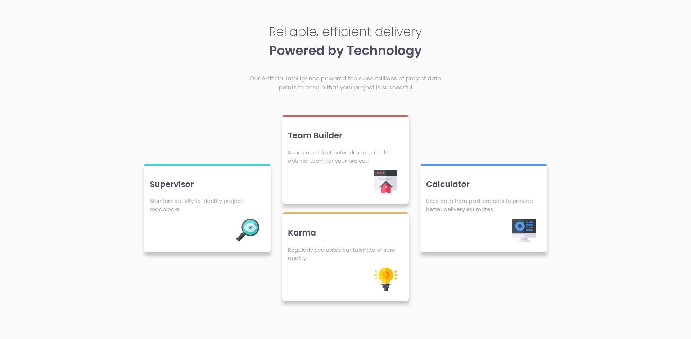

# Frontend Mentor - Four card feature section solution

This is a solution to the [Four card feature section challenge on Frontend Mentor](https://www.frontendmentor.io/challenges/four-card-feature-section-weK1eFYK). 

## Table of contents

- [Overview](#overview)
  - [The challenge](#the-challenge)
  - [Screenshot](#screenshot)
  - [Links](#links)
- [My process](#my-process)
  - [Built with](#built-with)
- [Author](#author)

## Overview

### The challenge

Users should be able to:

- View the optimal layout for the site depending on their device's screen size

### Screenshot

### Links

- Solution URL: [solution URL here](https://your-solution-url.com)
- Live Site URL: [live site URL here](https://your-live-site-url.com)

## My process

### Built with

- Semantic HTML5 markup
- Sass variables
- Flexbox
- Mobile-first workflow

## Author

- My GitHub profile - [Costi Voicu](https://github.com/CostiVoicu)
- Frontend Mentor - [@JustAFatRaccoon](https://www.frontendmentor.io/profile/JustAFatRaccoon)
- Twitter - [@VoicuCosti2](https://twitter.com/VoicuCosti2)
- Instagram - [@c0stiv0icu](https://www.instagram.com/c0stiv0icu/)